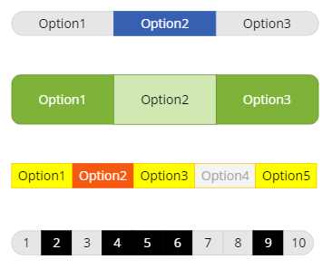

# ToggleSet component
This component allows you to add a fully customizable togglet set to your applications.

## Notes
The size of the toggle set items adjusts automatically to the width and height of the component.

## Properties
Here are the properties available to configure the component:
### Input
- **AllowNoSelection** (boolean) = if only one item is selected, allows the user to unselect it, thus having no items selected at all
- **BorderColor** (color) = color for the borders of the toggle set (as well as for the vertical separating lines between items)
- **BorderThickness** (number) = border thickness of the component
- **Color** (color) = text color for non-selected items
- **DisabledColor** (color) = text color for disabled items
- **DisabledFill** (color) = item fill color for disabled items
- **FontWeight** (color) = font weight for the item labels
- **Items** (table) = list of items for the toggle set (columns are: *Id*, *Value*, *Disabled*, *Size*, *Selected*)
- **ItemFill** (color) = fill color for non-selected items
- **Radius** (number) = in pixels, radius for the left and right corners of the component
- **Reset** (boolean) = resets the components to its defaults pre-selected items specified in the *Items* property (use the *Selected* column)
- **SelectedBorderColor** (color) = border color of selected items
- **SelectedColor** (color) = text color for selected items
- **SelectedFill** (color) = fill color for selected items
- **SelectMultiple** (boolean) = allows the selection of multiple items
- **Size** (number) = default font size for the item labels

### Output
- **SelectedItems** (table) = list of selected items (same structure as the *Items* input parameter)
- **OnChange** (boolean) = toggles to *True* when the items selection changes

## Examples
Using all these properties you can create various toggle sets like this:

## HISTORY changes
**v1.0** [ 24-mar-2020 ]
- Initial publish
